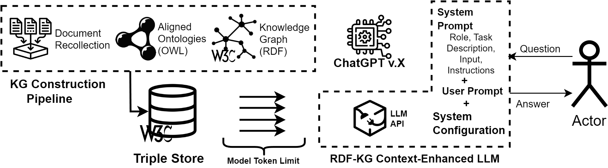
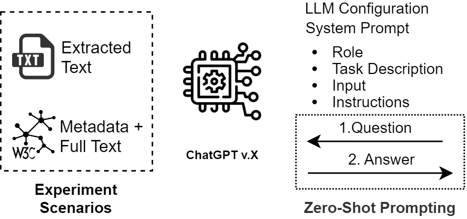

# Scaling Scientific Knowledge Discovery with Neuro-Symbolic AI in Large Language Models

[](https://opensource.org/licenses/MIT)


Welcome to the GitHub repository for our research on leveraging neuro-symbolic AI and Large Language Models (LLMs) for scientific knowledge discovery and systematic literature reviews (SLRs). This repository contains the system and user prompts used in our experiments, which aim to address the growing challenges in data-driven decision-making and the increasing volume of scientific publications.

## Table of Contents
  - [Overview](#overview)
  - [Citations](#citations)
  - [Troubleshooting](#troubleshooting)

## Overview

This repository contains the system and user prompts used in our experiments, which aim to address the growing challenges in data-driven decision-making and the increasing volume of scientific publications.

## Repository Contents

In this repository, you will find:

* **Experimental Scenarios:** A descriptions on the experimental setups used to evaluate the performance of LLMs and neuro-symbolic approaches.
* **System Prompts:** Carefully designed prompts used to guide the LLMs in providing structured and relevant responses.
* **User Prompts:** Examples of how users can interact with the system to extract meaningful information from large datasets.
* **Responses:** A collection of responses generated by the LLMs and neuro-symbolic systems, demonstrating their capabilities and limitations in the context of scientific knowledge discovery.

## Research Context

The field of AI is rapidly evolving, with novel approaches such as LLMs showing significant potential in various industrial applications. However, these models face challenges related to reliability and interpretability. To enhance the performance of LLMs, techniques such as context-enhanced prompting and Retrieval Augmented Generation (RAG) are employed. These methods help mitigate the phenomenon of "hallucinations" by allowing the models to retrieve relevant information from external sources, thereby improving the accuracy and reliability of their outputs.

<p align="center">
  
</p>

## Experimentation

Our experimentation process aims to evaluate the effectiveness of different AI approaches—human-based, LLM-based, and neuro-symbolic methods—in conducting Systematic Literature Reviews (SLRs) and scientific knowledge discovery. We focused on three primary approaches: document-based Retrieval Augmented Generation (RAG), RDF-KG-based context-enhanced LLMs, and prompt engineering techniques tailored for these methodologies. D escriptions of the experimental setups, prompts used, and responses generated are included in this repository, providing a comprehensive resource for further research and development in this area.

The experimentation scenarios included a variety of scientific knowledge discovery tasks, such as identifying key research trends, summarizing large volumes of literature, and answering specific research questions. By comparing the outputs of the different approaches, we were able to assess their strengths and limitations in terms of accuracy, reliability, and efficiency. 

<p align="center">
  
</p>


## Transparency and Accessibility

To address the lack of transparency in proprietary AI-supported SLR tools, we have made our system and user prompts publicly available. By providing access to our research methodologies and findings, we aim to contribute to the broader scientific community and encourage further exploration in this field.

## Citations 

If this work is with your interest, you can read the associated [paper](https://ceur-ws.org/Vol-3759/workshop4.pdf), and if you use it in your research, please don't forget to cite 👍 this work; the suggested citation in BibTex format is:

``` BibTex
@inproceedings{Schmidt2024b,
author = {Schmidt, Wilma and Rincon-Yanez, Diego and Kharlamov, Evgeny and Paschke, Adrian},
booktitle = {Joint Proceedings of Posters, Demos, Workshops, and Tutorials of the 20th International Conference on Semantic Systems co-located with 20th International Conference on Semantic Systems (SEMANTiCS 2024)},
publisher = {CEUR-WS},
title = {{Scaling Scientific Knowledge Discovery with Neuro-Symbolic AI and Large Language Models}},
volume = {3759},
url = {https://ceur-ws.org/Vol-3759/workshop4.pdf},
year = {2024}
}
```

## Troubleshooting

If there are any troubles or you have any questions, please open an issue stating the encountered problem. Contributing is always welcome. The [Github repository Issues URL](https://github.com/d1egoprog/KG-SLR4LLM/issues).  And contributing is always welcome. The [Github repository URL](https://github.com/d1egoprog/KG-SLR4LLM).


Happy hacking!! 🖖🖖.
